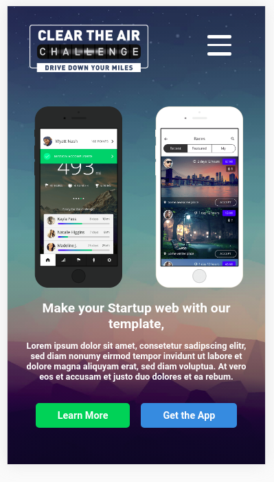
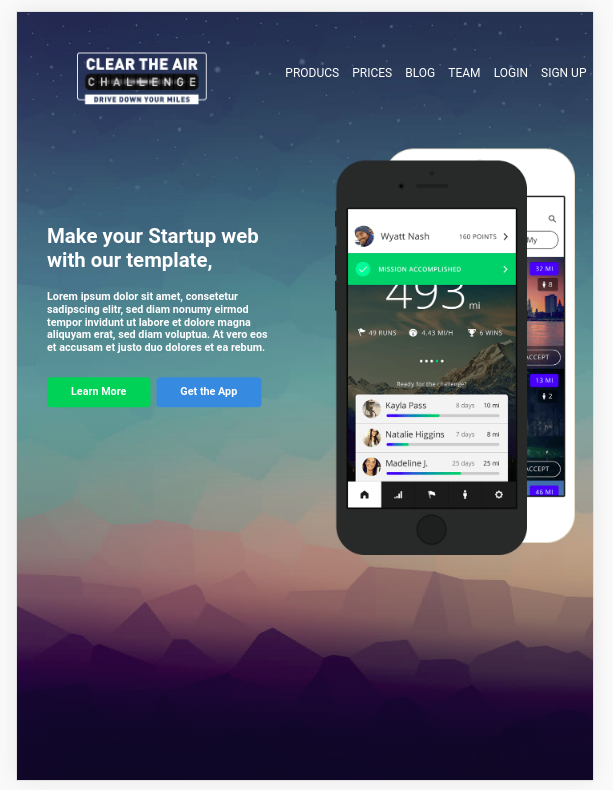
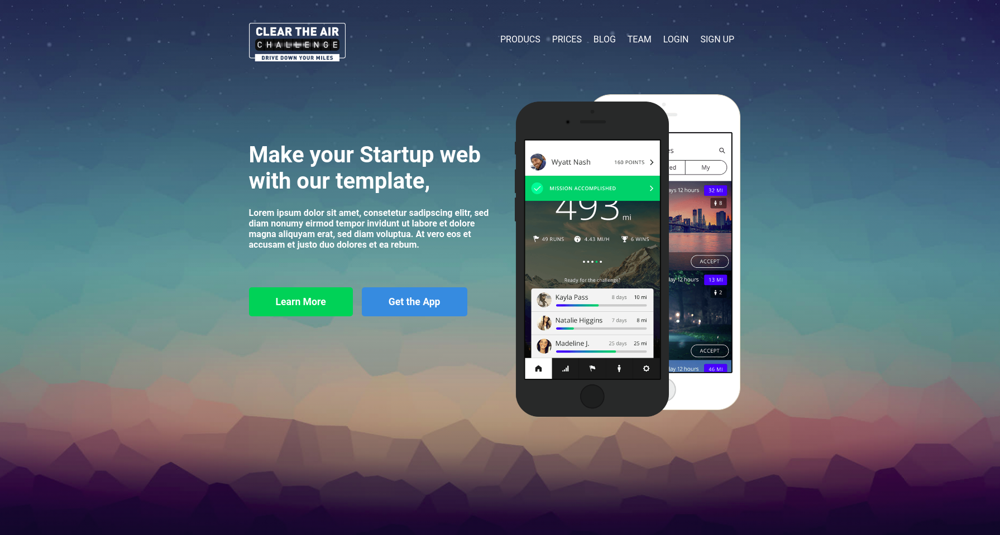

# Clear The Air

- Link of the project: https://kevschmidt.github.io/clear-the-air/
- Clone the repository: ``` git clone git@github.com:kevSchmidt/clear-the-air.git ```

### Model


### Exercise from DCI.
Reproduce the layout of the model given and make it responsive.

- Mobile Version

- Tablet Version

- Laptop Version


### Tools:
<h1>


</h1>

### Structure:
```
Project
│   README.md
│   package.json
|   package-lock.json
|
└─── src
      └─── img
      │  
      │  
      └─── scss
      │        └─── abstracts
      |        |        └─── mixins.scss
      |        |        └─── variables.scss 
      │        |
      |        └─── base
      |        |      └─── base.scss
      |        |      └─── typography.scss
      |        |
      |        └─── components
      |        |         └─── button.scss
      |        |
      |        └─── layout
      |        |       └─── header.scss
      |        |       └─── pictures.scss
      |        |  
      |        |  
      |        └─── pages
      |        |      └─── homes.scss
      |        |
      |        |
      |        └───  main.scss
      |
      └─── index.html
```

